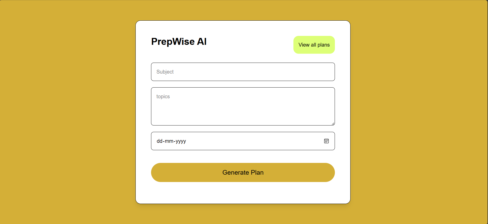
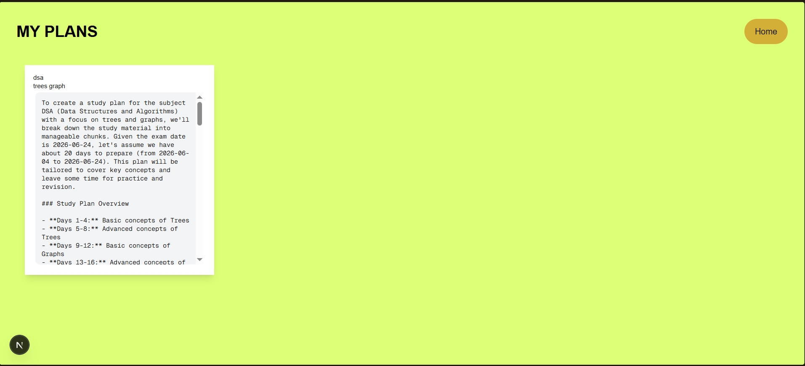

# 📚 PrepWise AI

An AI-powered study planner built with **Next.js**, **Supabase**, and **Groq API**.

Users enter a subject, topics, and exam date. PrepWise AI generates a personalized study plan using AI and stores it for later access.

---

## ✨ Features

* 🤖 AI-generated study plans
* 📅 Exam-oriented scheduling
* 💾 Save plans using Supabase
* 📖 View previous plans
* 🌐 Fully deployed on Vercel

---

## 🛠️ Tech Stack

* Next.js
* Tailwind CSS
* TypeScript
* Supabase
* Groq API
* Vercel

---

## 📂 Project Structure

```bash
prepwise-lite/

├── app/

│   ├── page.tsx

│   ├── layout.tsx

│   ├── plans/

│   │   └── page.tsx

│   └── api/

│       └── generate/

│           └── route.ts

│

├── components/

│   └── StudyForm.tsx

│

├── lib/

│   └── supabase.ts

│

├── .env.local

├── package.json

└── README.md
```

---

## ⚙️ Environment Variables

Create a file:

```bash
.env.local
```

Add:

```env
GROQ_API_KEY=your_groq_api_key

SUPABASE_URL=your_supabase_project_url

SUPABASE_API_KEY=your_supabase_publishable_key
```

---

## 🚀 Installation

Clone the repository:

```bash
git clone https://github.com/YOUR_USERNAME/prepwise-ai.git

cd prepwise-ai
```

Install dependencies:

```bash
npm install
```

Run development server:

```bash
npm run dev
```

Open:

```bash
http://localhost:3000
```

---

## 📸 Screenshots






---

## 🌐 Live Demo

Deployed on Vercel:

```text
prepwise-ai-sigma-one.vercel.app
```

---

## 🧠 How It Works

```text
User fills form
↓
Next.js frontend
↓
POST /api/generate
↓
Groq API generates study plan
↓
Supabase stores plan
↓
User views saved plans
↓ 
Vercel hosts application
```
